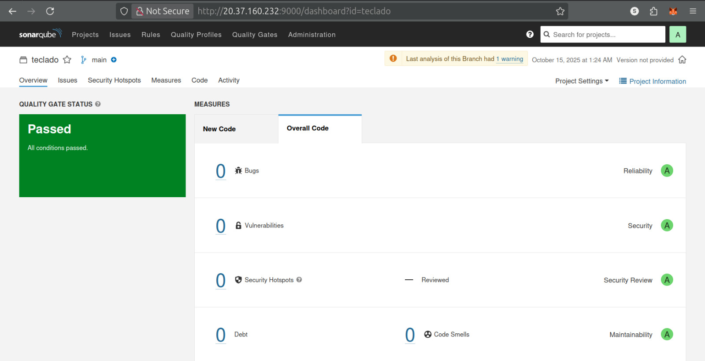

# Orquestación DevOps con Ansible - Pipeline CI/CD Completo

**Autores:**
- Santiago Valencia García - A00395902
- Pablo Fernando Pineda Patiño - A00395831

Este proyecto implementa la orquestación completa de un stack DevOps utilizando Ansible para automatizar el despliegue de Jenkins, SonarQube y servicios auxiliares sobre infraestructura Docker. El sistema está diseñado para ejecutarse sin intervención manual, configurando automáticamente todas las integraciones necesarias mediante Infrastructure as Code y Configuration as Code.




## Descripción General

El proyecto despliega un entorno de integración continua completamente funcional sobre máquinas virtuales Ubuntu 22.04 LTS aprovisionadas previamente con Terraform. La orquestación se divide en dos plays principales: uno para el servidor web Nginx y otro para el stack CI/CD completo (Jenkins + SonarQube + PostgreSQL).

La arquitectura se basa en contenedores Docker orquestados con Docker Compose, donde cada servicio cuenta con healthchecks, volúmenes persistentes y configuración declarativa. El playbook de Ansible ejecuta 476 líneas de lógica que automatizan desde la instalación de dependencias del sistema operativo hasta la generación de tokens de autenticación y la creación de pipelines.

## Arquitectura del Sistema

### Stack de Tecnologías

**Orquestación**
- Ansible 2.x: automatización de configuración y despliegue
- Docker CE: containerización de servicios
- Docker Compose v2: orquestación multi-contenedor

**Servicios Principales**
- Jenkins LTS (imagen personalizada): servidor de integración continua
- SonarQube 9.9.4 Community: análisis estático de código
- PostgreSQL 13: base de datos para SonarQube
- Nginx: servidor web para aplicación estática

**Herramientas Integradas**
- Node.js 18.20.2 LTS: runtime JavaScript
- SonarScanner CLI 5.0.1: cliente de análisis SonarQube
- Jenkins Configuration as Code (JCasC): configuración declarativa
- Job DSL: creación programática de pipelines

## Estructura del Proyecto

```
ansible-pipeline/
├── playbook.yml              # Playbook principal con toda la lógica de orquestación
├── inventory                 # Inventario con IPs públicas de Azure y credenciales
├── docker-compose.yml        # Definición de servicios Docker
├── requirements.txt          # Dependencias Python para Ansible
├── .env.example              # Plantilla de variables de entorno
├── .gitignore                # Exclusiones de control de versiones
├── jenkins/
│   ├── Dockerfile            # Imagen personalizada de Jenkins
│   ├── plugins.txt           # Lista de plugins Jenkins
│   └── casc.yaml             # Configuración Jenkins as Code
└── README.md                 # Este documento
```

## Decisiones de Diseño y Justificación

### 1. Separación en Dos Plays

**Decisión:** El playbook se divide en dos plays independientes (`nginx` y `jenkins`).

**Justificación:** Esta separación permite escalabilidad y mantenibilidad. El servidor Nginx se dedica exclusivamente a servir contenido estático, mientras que el servidor Jenkins concentra servicios pesados de CI/CD. Si en el futuro se requiere escalar Jenkins (más ejecutores, más memoria), no afecta al servidor web. Además, facilita el debugging al aislar componentes por host.

**Alternativas consideradas:** Un solo servidor con todos los servicios. Se descartó por limitaciones de recursos (Standard_B2s tiene solo 4GB RAM) y por principios de diseño de microservicios.

### 2. Imagen Docker Personalizada de Jenkins

**Decisión:** Construir una imagen custom desde `jenkins/jenkins:lts` en lugar de usar la imagen oficial directamente.

**Justificación:** La instalación de Node.js y SonarScanner CLI directamente en la imagen garantiza disponibilidad inmediata en todos los pipelines sin depender de plugins que pueden fallar o causar incompatibilidades. Durante el desarrollo se experimentaron errores `NoClassDefFoundError` con plugins de NodeJS, lo que llevó a esta arquitectura más robusta.

**Implementación técnica:**
```dockerfile
# Instalación de Node.js desde binarios oficiales
ENV NODE_VERSION=18.20.2
RUN curl -fsSL https://nodejs.org/dist/v${NODE_VERSION}/node-v${NODE_VERSION}-linux-x64.tar.xz -o /tmp/node.tar.xz \
    && tar -xJf /tmp/node.tar.xz -C /usr/local/lib/nodejs \
    && ln -s /usr/local/lib/nodejs/node-v${NODE_VERSION}-linux-x64/bin/node /usr/local/bin/node
```

Esta aproximación evita gestores de versiones (nvm) que complican la configuración en pipelines, y proporciona versiones exactas reproducibles.

### 3. Plugins Mínimos de Jenkins

**Decisión:** Instalar solo 9 plugins esenciales en lugar del set completo recomendado.

**Justificación:** Cada plugin añade complejidad, superficie de ataque de seguridad y potencial de incompatibilidades. El set mínimo incluye:

- `configuration-as-code`: habilita JCasC
- `workflow-aggregator` y `pipeline-model-definition`: soporte de pipelines declarativos
- `git` y `git-client`: integración con repositorios
- `credentials` y `credentials-binding`: gestión segura de secretos
- `job-dsl`: creación programática de jobs
- `matrix-auth`: autorizaciones granulares

Todos se instalan en versión `:latest` para obtener parches de seguridad automáticamente. Esta decisión se tomó tras múltiples fallos con sets de plugins más grandes que causaban crashes por falta de memoria.

### 4. Healthchecks y Tiempos de Espera

**Decisión:** Implementar healthchecks agresivos en Docker Compose y esperas con retries en Ansible.

**Justificación:** Jenkins y SonarQube requieren tiempo de inicialización (descarga de dependencias, indexación de bases de datos). Sin healthchecks apropiados, los contenedores dependientes fallan al no encontrar servicios listos.

**Configuración Jenkins:**
```yaml
healthcheck:
  test: ["CMD-SHELL", "wget --spider -q http://localhost:8080/login || exit 1"]
  interval: 20s
  timeout: 10s
  retries: 20
  start_period: 300s  # 5 minutos para inicialización completa
```

El `start_period` de 300 segundos es crucial: permite que Jenkins descargue plugins, compile configuración JCasC y arranque completamente antes de marcar el contenedor como unhealthy.

**Espera en Ansible:**
```yaml
- name: Esperar a que Jenkins esté respondiendo
  uri:
    url: "http://{{ ansible_default_ipv4.address }}:80/login"
    method: GET
    status_code: [200, 302, 403, 503]
  until: jenkins_status.status in [200, 302, 403, 503]
  retries: 60
  delay: 5
```

Se acepta HTTP 503 porque durante el bootstrap Jenkins responde con este código mientras carga configuración. Rechazarlo causaría fallos prematuros.

### 5. Generación Automática de Token SonarQube

**Decisión:** Generar el token de SonarQube mediante API y actualizar `.env` dinámicamente en lugar de configuración manual.

**Justificación:** Esta es la pieza clave de automatización que elimina pasos manuales. El flujo implementado es:

1. Esperar SonarQube UP (status API)
2. Cambiar contraseña admin desde `admin` a `Admin123!`
3. Intentar generar token `jenkins-ci`
4. Si falla (token existe), revocarlo y regenerar
5. Extraer token de respuesta JSON
6. Actualizar archivo `.env` con token real
7. Reiniciar Jenkins con credenciales válidas

**Manejo de errores:**
```yaml
- name: Generar token de SonarQube para Jenkins
  uri:
    url: "http://{{ ansible_default_ipv4.address }}:9000/api/user_tokens/generate"
    body:
      name: jenkins-ci
    status_code: [200, 400]  # 400 si ya existe
  register: token_result
  failed_when: false
```

El patrón `failed_when: false` permite manejar tanto creación nueva como tokens existentes sin interrumpir el playbook.

### 6. Limpieza de Volumen Jenkins

**Decisión:** Eliminar `plugins/`, `war/`, `caches/` y `updates/` del volumen antes de cada despliegue.

**Justificación:** Durante iteraciones de debugging se descubrió que Jenkins persiste plugins descargados en el volumen `jenkins-data`. Si se cambia la lista de plugins en `plugins.txt`, Jenkins carga tanto los nuevos como los viejos, causando conflictos de classpath (`NoClassDefFoundError: org/jenkinsci/plugins/workflow/support/steps/build/TraversalMethodContext`).

**Implementación:**
```yaml
- name: Limpiar plugins persistidos en el volumen
  shell: |
    if docker volume inspect jenkins-data >/dev/null 2>&1; then
      VOLUME_PATH=$(docker volume inspect jenkins-data --format '{{.Mountpoint}}')
      rm -rf "$VOLUME_PATH/plugins" "$VOLUME_PATH/war" "$VOLUME_PATH/caches" "$VOLUME_PATH/updates" || true
    fi
```

Esta limpieza garantiza que cada despliegue parte de estado limpio, alineado con el principio de inmutabilidad de infraestructura.

### 7. Versiones Fijas de Dependencias Python

**Decisión:** Instalar versiones específicas de `docker`, `requests` y `urllib3` en lugar de versiones latest.

**Justificación:** Ansible utiliza el módulo `community.docker.docker_compose_v2` que internamente depende de la librería Python `docker`. Durante el desarrollo se encontró incompatibilidad entre versiones:

- `docker>=7.2.0` con `requests>=2.33.0` causaba errores de importación
- `urllib3>=2.3.0` cambió API interna usada por `requests`

**Solución:**
```yaml
- name: Instalar docker Python module con versiones compatibles
  pip:
    name:
      - docker==7.1.0
      - requests==2.32.3
      - urllib3==2.2.2
    state: present
```

Estas versiones han sido validadas como compatibles entre sí y con Ansible 2.x.

### 8. Configuración de Kernel para SonarQube

**Decisión:** Establecer `vm.max_map_count=262144` vía `sysctl`.

**Justificación:** SonarQube utiliza Elasticsearch internamente, que requiere aumentar el límite de mapas de memoria virtual del kernel. Sin esta configuración, SonarQube falla con error:

```
max virtual memory areas vm.max_map_count [65530] is too low, increase to at least [262144]
```

**Implementación:**
```yaml
- name: Establecer vm.max_map_count en el kernel
  sysctl:
    name: vm.max_map_count
    value: "262144"
    state: present
    reload: yes
```

El parámetro `reload: yes` aplica el cambio inmediatamente sin requerir reinicio.

### 9. Swap Opcional

**Decisión:** Crear swap de 2GB solo si no existe previamente.

**Justificación:** Las VMs Standard_B2s tienen 4GB de RAM física. Jenkins + SonarQube + PostgreSQL pueden consumir 3.5GB bajo carga. Añadir swap previene OOM (Out of Memory) kills durante picos de uso.

**Implementación idempotente:**
```yaml
- name: Verificar si hay swap activo
  command: swapon --show --noheadings
  register: swap_show
  changed_when: false

- name: Crear swapfile de 2G si no existe
  block:
    - name: Crear archivo de swap
      command: fallocate -l 2G /swapfile
      args:
        creates: /swapfile
  when: swap_show.stdout | trim == ''
```

El uso de `creates` garantiza idempotencia: no recrea el swap si ya existe.

### 10. Jenkins Configuration as Code (JCasC)

**Decisión:** Configurar Jenkins completamente mediante archivo YAML en lugar de UI.

**Justificación:** JCasC permite versionar configuración, reproduce entornos idénticamente y elimina clicks manuales. La configuración incluye:

**Usuario admin:**
```yaml
securityRealm:
  local:
    allowsSignup: false
    users:
      - id: "admin"
        password: "${JENKINS_ADMIN_PASSWORD}"
```

**Permisos globales:**
```yaml
authorizationStrategy:
  globalMatrix:
    permissions:
      - "Overall/Administer:admin"
      - "Overall/Read:authenticated"
```

**Variables de entorno globales:**
```yaml
globalNodeProperties:
  - envVars:
      env:
        - key: SONARQUBE_URL
          value: "${SONARQUBE_URL}"
        - key: SONAR_TOKEN
          value: "${SONAR_TOKEN}"
        - key: PATH
          value: "/usr/local/bin:/usr/local/lib/nodejs/node-v18.20.2-linux-x64/bin:..."
```

El PATH extendido incluye las rutas donde se instalaron Node.js y SonarScanner, haciéndolos disponibles en todos los pipelines sin configuración adicional.

**URL pública:**
```yaml
unclassified:
  location:
    url: "${JENKINS_URL}"
```

Esta configuración previene redirecciones a IPs privadas, un problema común en Jenkins detrás de proxies.

**Credenciales:**
```yaml
credentials:
  system:
    domainCredentials:
      - credentials:
          - string:
              scope: GLOBAL
              id: "SONAR_TOKEN"
              secret: "${SONAR_TOKEN}"
```

El token se inyecta desde variable de entorno, nunca hardcodeado.

**Job DSL para pipeline:**
```yaml
jobs:
  - script: |
      pipelineJob('pipeline-teclado') {
        definition {
          cpsScm {
            scm {
              git {
                remote {
                  url('https://github.com/Pabl0FPP/Teclado')
                }
                branches('main')
              }
            }
            scriptPath('Jenkinsfile')
          }
        }
      }
```

Esta configuración crea automáticamente el pipeline que clona el repositorio y ejecuta el `Jenkinsfile`.

### 11. Estrategia de Arranque Secuencial

**Decisión:** Arrancar servicios en orden específico: db → sonarqube → jenkins.

**Justificación:** Las dependencias entre servicios requieren este orden:

1. **PostgreSQL primero:** SonarQube no arranca sin base de datos
2. **SonarQube segundo:** Debe estar UP para generar token
3. **Jenkins último:** Necesita token válido para configurar integración

**Implementación en Ansible:**
```yaml
# PASO 1: Build Jenkins image (sin iniciar)
- name: Build Jenkins custom image
  community.docker.docker_compose_v2:
    build: always
    state: present
    services:
      - jenkins

# PASO 2: Iniciar solo db y sonarqube
- name: Start database and SonarQube services
  community.docker.docker_compose_v2:
    state: present
    services:
      - db
      - sonarqube

# PASO 3: Esperar SonarQube UP

# PASO 4-6: Generar token y actualizar .env

# PASO 7: Iniciar Jenkins con token real
- name: Iniciar Jenkins con el token real
  community.docker.docker_compose_v2:
    state: present
    recreate: always
```

El flag `recreate: always` fuerza recreación de contenedores, cargando variables de entorno actualizadas.

### 12. Docker Compose v2 Plugin vs. Standalone

**Decisión:** Usar Docker Compose v2 plugin (`docker compose`) en lugar de v1 standalone (`docker-compose`).

**Justificación:** Compose v2 es la versión actual mantenida por Docker Inc., escrita en Go (más rápida que Python v1). Se instala como plugin de Docker CLI, integrado nativamente.

**Instalación:**
```yaml
- name: Instalar Docker Compose v2 plugin
  apt:
    name: docker-compose-plugin
    state: present
```

El módulo Ansible `community.docker.docker_compose_v2` requiere específicamente esta versión.

### 13. Gestión de Secretos

**Decisión:** Usar archivo `.env` para secretos en lugar de variables hardcodeadas.

**Justificación:** El archivo `.env` está excluido de Git (`.gitignore`), previniendo exposición accidental de credenciales. Docker Compose lo carga automáticamente.

**Limitaciones actuales:**
```yaml
vars:
  jenkins_admin_password: "admin123"  # TODO: Move to Ansible Vault
  sonar_admin_password: "Admin123!"   # TODO: Move to Ansible Vault
```

Para producción se recomienda migrar a Ansible Vault:
```bash
ansible-vault encrypt_string 'admin123' --name 'jenkins_admin_password'
```

### 14. Permisos de Volumen Jenkins

**Decisión:** Establecer ownership `1000:1000` en el volumen `jenkins-data`.

**Justificación:** El contenedor Jenkins ejecuta como usuario `jenkins` con UID/GID 1000. Si el volumen pertenece a root, Jenkins no puede escribir configuración ni logs, causando crashloop.

**Implementación:**
```yaml
- name: Asegurar ownership del volumen jenkins-data
  shell: |
    if docker volume inspect jenkins-data >/dev/null 2>&1; then
      VOLUME_PATH=$(docker volume inspect jenkins-data --format '{{.Mountpoint}}')
      chown -R 1000:1000 "$VOLUME_PATH"
    fi
  become: yes
```

El comando verifica existencia del volumen antes de cambiar permisos, evitando errores en primera ejecución.

## Flujo de Ejecución Completo

### Fase 1: Preparación del Sistema Operativo

1. **Actualización de paquetes:** `apt update` para cache actual
2. **Instalación de dependencias:** curl, ca-certificates, gnupg, python3-pip
3. **Configuración de repositorio Docker:** GPG key y sources.list
4. **Instalación Docker CE:** desde repositorio oficial Docker
5. **Añadir usuario a grupo docker:** permite comandos sin sudo
6. **Instalación Docker Compose v2:** plugin integrado
7. **Actualización pip:** última versión para instalar módulos Python
8. **Instalación módulos Python:** docker SDK con versiones fijas compatibles
9. **Configuración kernel:** vm.max_map_count para Elasticsearch
10. **Creación de swap:** si no existe, para prevenir OOM

### Fase 2: Preparación de Archivos de Configuración

1. **Creación de directorio jenkins:** contexto de build Docker
2. **Copia de Dockerfile:** imagen personalizada con Node y SonarScanner
3. **Copia de plugins.txt:** lista de plugins mínimos
4. **Copia de casc.yaml:** configuración JCasC completa
5. **Generación de .env:** con placeholders para token
6. **Copia de docker-compose.yml:** definición de servicios

### Fase 3: Construcción de Imagen Jenkins

1. **Build de imagen:** `docker compose build jenkins`
   - Descarga imagen base `jenkins/jenkins:lts`
   - Instala plugins desde plugins.txt
   - Instala Node.js 18.20.2 desde binarios tar.xz
   - Instala SonarScanner CLI 5.0.1 desde zip
   - Crea symlinks en /usr/local/bin

### Fase 4: Arranque de Base de Datos y SonarQube

1. **Inicio de PostgreSQL:** imagen `postgres:13`
2. **Healthcheck db:** espera hasta `pg_isready` exitoso
3. **Inicio SonarQube:** imagen `sonarqube:9.9.4-community`
4. **Espera SonarQube UP:** polling a `/api/system/status` hasta `status=UP`
   - Retries: 40 × 15s = 10 minutos máximo
   - Necesario porque SonarQube indexa base de datos en primer arranque

### Fase 5: Configuración Automática de SonarQube

1. **Cambio de contraseña admin:**
   - POST a `/api/users/change_password`
   - Autenticación básica con `admin:admin`
   - Nueva contraseña: `Admin123!`
   - Status 204 (exitoso) o 400 (ya cambiada previamente)

2. **Generación de token:**
   - POST a `/api/user_tokens/generate` con `name=jenkins-ci`
   - Si 200: extraer token de respuesta JSON
   - Si 400: token ya existe, ejecutar bloque de revocación

3. **Revocación y regeneración (si necesario):**
   - POST a `/api/user_tokens/revoke` con `name=jenkins-ci`
   - POST nuevamente a `/api/user_tokens/generate`
   - Extraer token de nueva respuesta

4. **Validación de token:**
   - Verificar que variable `sonar_token` esté definida y no vacía
   - Fallar playbook si no se obtuvo token (señal de problema API)

5. **Actualización de .env:**
   - Usar `lineinfile` para reemplazar `SONAR_TOKEN=placeholder`
   - Nuevo valor: token real generado (formato `squ_...`)

### Fase 6: Preparación de Volumen Jenkins

1. **Detener contenedores:** asegurar que volumen no esté en uso
2. **Limpieza de artefactos persistidos:**
   - Eliminar `plugins/` (evita conflictos con plugins.txt)
   - Eliminar `war/` (fuerza uso de versión de imagen)
   - Eliminar `caches/` y `updates/` (limpiar metadata obsoleta)
3. **Corrección de ownership:** `chown -R 1000:1000` en mountpoint del volumen

### Fase 7: Arranque de Jenkins con Configuración Completa

1. **Docker Compose up con recreate:**
   - `state: present` + `recreate: always`
   - Variables de entorno con token real de SonarQube
   - Jenkins lee casc.yaml y aplica configuración
   - JCasC crea usuario admin, configura permisos, crea credencial SONAR_TOKEN
   - Job DSL crea pipeline `pipeline-teclado`

2. **Espera de respuesta HTTP Jenkins:**
   - Polling a `http://<ip>:80/login`
   - Acepta códigos 200, 302, 403, 503
   - 503 es válido durante bootstrap (carga de plugins)
   - Retries: 60 × 5s = 5 minutos máximo

### Fase 8: Validación y Resumen

1. **Verificación de contenedores:** `docker ps` con formato tabla
2. **Mostrar resumen:** URLs de acceso, credenciales, token generado

## Variables de Entorno

### Variables en Playbook

**jenkins_admin_password**  
Contraseña del usuario admin de Jenkins. Se inyecta en JCasC vía variable de entorno `JENKINS_ADMIN_PASSWORD`. Valor actual: `admin123` (TODO: migrar a Ansible Vault).

**sonar_admin_password**  
Contraseña del usuario admin de SonarQube. Se utiliza para cambiar password por defecto y autenticar API calls. Valor actual: `Admin123!` (TODO: migrar a Ansible Vault).

**jenkins_host**  
IP pública del servidor Jenkins extraída automáticamente del inventario Ansible. Se usa para configurar `location.url` en JCasC, previniendo redirecciones a IP privada.

**sonar_token**  
Token de autenticación generado dinámicamente por la API de SonarQube. Se extrae de respuesta JSON y se inyecta en Jenkins vía JCasC.

### Variables en Docker Compose

**JENKINS_ADMIN_PASSWORD**  
Leída desde `.env`, se inyecta en contenedor Jenkins y se referencia en casc.yaml como `${JENKINS_ADMIN_PASSWORD}`.

**SONARQUBE_URL**  
URL interna del servicio SonarQube (`http://sonarqube:9000`). Se configura como variable de entorno global en Jenkins vía JCasC.

**SONAR_TOKEN**  
Token generado automáticamente, inyectado en Jenkins para autenticación con SonarQube.

**JENKINS_URL**  
URL pública del servidor Jenkins (`http://<IP_PUBLICA>`). Configurada en JCasC `location.url`.

**CASC_JENKINS_CONFIG**  
Ruta al archivo de configuración JCasC dentro del contenedor (`/usr/share/jenkins/ref/casc.yaml`).

**JAVA_OPTS**  
Opciones de JVM para Jenkins:
- `-Djenkins.install.runSetupWizard=false`: deshabilita wizard de configuración inicial
- `-Xms256m`: heap inicial de 256MB
- `-Xmx1024m`: heap máximo de 1GB (previene OOM en VM de 4GB)

## Volúmenes Docker

### jenkins-data

**Propósito:** Persistir configuración, jobs, build history y workspace de Jenkins.

**Mountpoint:** `/var/jenkins_home` dentro del contenedor.

**Gestión:** El playbook limpia `plugins/`, `war/`, `caches/` y `updates/` antes de cada despliegue para garantizar estado limpio. Ownership establecido a `1000:1000` (usuario jenkins).

### sonarqube_conf, sonarqube_data, sonarqube_extensions

**Propósito:** Persistir configuración, índices Elasticsearch y plugins de SonarQube.

**Mountpoints:**
- `/opt/sonarqube/conf`
- `/opt/sonarqube/data`
- `/opt/sonarqube/extensions`

**Gestión:** Docker gestiona ciclo de vida. No se limpian entre despliegues para preservar proyectos analizados.

### postgresql, postgresql_data

**Propósito:** Persistir base de datos PostgreSQL (usuarios, proyectos, análisis de SonarQube).

**Mountpoints:**
- `/var/lib/postgresql`
- `/var/lib/postgresql/data`

**Gestión:** Volúmenes nombrados gestionados por Docker. Críticos para preservar datos entre reinicios.

## Healthchecks

### Jenkins

```yaml
healthcheck:
  test: ["CMD-SHELL", "wget --spider -q http://localhost:8080/login || exit 1"]
  interval: 20s
  timeout: 10s
  retries: 20
  start_period: 300s
```

**Justificación del start_period largo:** Jenkins requiere:
1. Inicializar JVM (30s)
2. Descargar y descomprimir plugins (60-120s)
3. Procesar configuración JCasC (30s)
4. Inicializar Job DSL (20s)
5. Iniciar servidor HTTP (10s)

Total estimado: 150-210s. Se asignan 300s (5 minutos) para margen de seguridad.

### SonarQube

```yaml
healthcheck:
  test: ["CMD-SHELL", "wget --no-verbose --tries=1 --spider http://localhost:9000/api/system/status || exit 1"]
  interval: 30s
  timeout: 10s
  retries: 10
  start_period: 180s
```

**Justificación:** SonarQube inicializa Elasticsearch embebido, indexa base de datos y arranca servidor web. El endpoint `/api/system/status` retorna JSON con `status: "UP"` cuando está completamente operativo.

### PostgreSQL

```yaml
healthcheck:
  test: ["CMD-SHELL", "pg_isready -U sonar"]
  interval: 10s
  timeout: 5s
  retries: 5
```

**Justificación:** Base de datos arranca rápido (<30s). El comando `pg_isready` verifica que PostgreSQL acepta conexiones.

## Dependencias entre Servicios

### SonarQube depends_on db

```yaml
sonarqube:
  depends_on:
    db:
      condition: service_healthy
```

**Efecto:** Docker Compose espera a que PostgreSQL pase healthcheck antes de iniciar SonarQube. Previene errores de conexión de base de datos.

### Jenkins depends_on sonarqube

```yaml
jenkins:
  depends_on:
    - sonarqube
```

**Nota:** Se usa dependencia simple (`started`) no `healthy` porque el playbook Ansible gestiona la espera de SonarQube UP antes de generar token. Jenkins puede arrancar en paralelo con SonarQube inicializando.

## Inventario Ansible

```ini
[all:vars]
ansible_user=adminuser
ansible_password=P@ssw0rd1234!
ansible_ssh_common_args='-o StrictHostKeyChecking=no -o UserKnownHostsFile=/dev/null'
ansible_python_interpreter=/usr/bin/python3

[nginx]
132.196.3.87

[jenkins]
20.12.193.55
```

**ansible_ssh_common_args:** Deshabilitando StrictHostKeyChecking se evita prompt interactivo en primer conexión. Apropiado para entornos efímeros de desarrollo/pruebas. En producción se recomienda gestionar known_hosts explícitamente.

**ansible_python_interpreter:** Ubuntu 22.04 usa Python 3 por defecto. Se especifica ruta explícita para evitar warnings de Ansible.

## Seguridad

### Credenciales

**Estado Actual:** Contraseñas en texto plano en playbook.yml.

**Riesgo:** Exposición accidental en control de versiones o logs.

**Mitigación Recomendada:**
```yaml
# Crear archivo encriptado
ansible-vault create group_vars/all/vault.yml

# Contenido:
vault_jenkins_password: admin123
vault_sonar_password: Admin123!

# Usar en playbook:
vars:
  jenkins_admin_password: "{{ vault_jenkins_password }}"
  sonar_admin_password: "{{ vault_sonar_password }}"

# Ejecutar playbook:
ansible-playbook playbook.yml --ask-vault-pass
```

### Puertos Expuestos

**Jenkins:** 80 (HTTP), 50000 (JNLP agent)  
**SonarQube:** 9000 (HTTP)  
**PostgreSQL:** No expuesto (solo red interna Docker)

**Riesgo:** Jenkins y SonarQube accesibles públicamente sin HTTPS.

**Mitigación Recomendada:**
- Configurar reverse proxy Nginx con certificados Let's Encrypt
- Implementar autenticación adicional (OAuth, LDAP)
- Restringir acceso por NSG a IPs específicas

### Actualizaciones

**Plugins Jenkins:** Configurados como `:latest` para recibir parches de seguridad.

**Imágenes Docker:** Versiones específicas (`jenkins/jenkins:lts`, `sonarqube:9.9.4-community`, `postgres:13`).

**Proceso de Actualización:**
1. Revisar changelog de nueva versión
2. Actualizar tag en Dockerfile/docker-compose.yml
3. Re-ejecutar playbook Ansible
4. Validar funcionalidad

## Troubleshooting

### Jenkins no arranca (crashloop)

**Síntoma:** Contenedor se reinicia continuamente.

**Diagnóstico:**
```bash
docker logs jenkins
```

**Causas comunes:**
1. **Permisos volumen:** Verificar ownership 1000:1000
2. **Memoria insuficiente:** Revisar `docker stats`, considerar reducir JAVA_OPTS
3. **Plugins incompatibles:** Ejecutar limpieza de volumen manualmente

**Solución:**
```bash
# Limpiar volumen
docker volume rm jenkins-data
# Re-ejecutar playbook
ansible-playbook playbook.yml
```

### SonarQube falla al arrancar

**Síntoma:** Error `max virtual memory areas vm.max_map_count [65530] is too low`.

**Diagnóstico:**
```bash
docker logs sonarqube
sysctl vm.max_map_count
```

**Solución:**
```bash
sudo sysctl -w vm.max_map_count=262144
# Hacer persistente
echo "vm.max_map_count=262144" | sudo tee -a /etc/sysctl.conf
```

### Token SonarQube no se genera

**Síntoma:** Playbook falla en tarea "Validar que se obtuvo el token".

**Diagnóstico:**
```bash
# Verificar estado SonarQube
curl http://<IP>:9000/api/system/status
# Probar generación manual
curl -u admin:Admin123! -X POST "http://<IP>:9000/api/user_tokens/generate?name=test"
```

**Causas comunes:**
1. SonarQube no completó inicialización
2. Contraseña incorrecta (no se cambió de 'admin')
3. Red Docker no permite comunicación

**Solución:**
```bash
# Aumentar retries en playbook
retries: 60
delay: 15

# O esperar manualmente y re-ejecutar
sleep 300
ansible-playbook playbook.yml
```

### Pipeline falla con "No such DSL method"

**Síntoma:** Error `No such DSL method 'nodejs' found among steps`.

**Causa:** Plugin nodejs-plugin no instalado o incompatible.

**Solución:** No usar bloque `tools` en Jenkinsfile. Node.js está disponible globalmente en PATH.

```groovy
// NO hacer esto
tools {
  nodejs 'NodeJS 18'
}

// Usar directamente
sh 'node --version'
sh 'npm --version'
```

### Incompatibilidad Docker SDK Python

**Síntoma:** Error al ejecutar módulo `docker_compose_v2` de Ansible.

**Diagnóstico:**
```bash
python3 -c "import docker; print(docker.__version__)"
```

**Solución:** Reinstalar con versiones fijas:
```bash
pip3 install docker==7.1.0 requests==2.32.3 urllib3==2.2.2
```

## Mantenimiento

### Actualización de Versiones de Herramientas

**Node.js:**
```dockerfile
# En jenkins/Dockerfile
ENV NODE_VERSION=20.11.0  # Nueva versión LTS
```

**SonarScanner:**
```dockerfile
ENV SONAR_SCANNER_VERSION=5.0.2.XXXX
```

Tras actualizar Dockerfile, re-ejecutar playbook con `build: always` para forzar reconstrucción.

### Backup de Volúmenes

**Jenkins:**
```bash
docker run --rm -v jenkins-data:/data -v $(pwd):/backup ubuntu tar czf /backup/jenkins-backup.tar.gz /data
```

**SonarQube:**
```bash
docker run --rm -v sonarqube_data:/data -v $(pwd):/backup ubuntu tar czf /backup/sonarqube-backup.tar.gz /data
```

**PostgreSQL:**
```bash
docker exec postgres pg_dump -U sonar sonar > sonarqube-db-backup.sql
```

### Restauración

**Jenkins:**
```bash
docker volume create jenkins-data
docker run --rm -v jenkins-data:/data -v $(pwd):/backup ubuntu tar xzf /backup/jenkins-backup.tar.gz -C /
```

**PostgreSQL:**
```bash
docker exec -i postgres psql -U sonar sonar < sonarqube-db-backup.sql
```

## Mejoras Futuras

### Migración a Ansible Vault

Encriptar credenciales sensibles para cumplir estándares de seguridad empresarial.

### Implementación de HTTPS

Configurar certificados SSL/TLS con Let's Encrypt y reverse proxy Nginx.

### Monitoreo y Alertas

Integrar Prometheus + Grafana para métricas de contenedores y Jenkins + SonarQube.

### Alta Disponibilidad

Configurar múltiples nodos Jenkins con ejecutores distribuidos y SonarQube con Data Center Edition.

### Pipeline de Testing

Añadir tests de Ansible con Molecule para validar playbook en diferentes sistemas operativos.

### Gestión de Secretos Empresarial

Integrar HashiCorp Vault o Azure Key Vault para rotación automática de credenciales.

## Ejecución del Proyecto

### Prerequisitos

- Infraestructura Azure desplegada con Terraform (proyecto `terraform_for_each_vm`)
- Ansible >= 2.10 instalado en máquina local
- Python 3.8+ con pip
- Acceso SSH a las VMs (puerto 22 abierto en NSG)

### Instalación de Dependencias

```bash
# Instalar Ansible (si no está instalado)
pip3 install ansible

# Instalar colección Docker de Ansible
ansible-galaxy collection install community.docker
```

### Configuración

1. **Actualizar inventario** con IPs públicas de Terraform:
```bash
terraform -chdir=../terraform_for_each_vm output ip_servers
```

2. **Verificar conectividad:**
```bash
ansible all -i inventory -m ping
```

### Ejecución del Playbook

```bash
# Ejecución completa
ansible-playbook -i inventory playbook.yml

# Ejecución con verbose (para debugging)
ansible-playbook -i inventory playbook.yml -vvv

# Ejecutar solo play de Jenkins
ansible-playbook -i inventory playbook.yml --limit jenkins
```

### Validación Post-Despliegue

```bash
# Verificar servicios
ansible jenkins -i inventory -m shell -a "docker ps"

# Verificar logs Jenkins
ansible jenkins -i inventory -m shell -a "docker logs jenkins --tail 50"

# Verificar logs SonarQube
ansible jenkins -i inventory -m shell -a "docker logs sonarqube --tail 50"

# Acceder a Jenkins
curl http://<IP_JENKINS>/login

# Acceder a SonarQube
curl http://<IP_JENKINS>:9000/api/system/status
```

## Métricas del Proyecto

**Tiempo de Ejecución:**
- Primera ejecución (con descargas): ~15-20 minutos
- Ejecuciones subsecuentes (con cache): ~8-12 minutos

## Conclusión

Este proyecto demuestra implementación completa de Infrastructure as Code y Configuration as Code para un stack DevOps real. Cada decisión técnica está justificada por problemas encontrados durante iteraciones de desarrollo y debugging.

El sistema resultante es completamente reproducible: ejecutar el playbook en cualquier VM Ubuntu 22.04 con las especificaciones apropiadas produce un entorno idéntico con Jenkins, SonarQube y todos sus integraciones configuradas automáticamente.

El código está diseñado para ser mantenible y extensible, siguiendo principios de:
- **Idempotencia:** Ejecutar múltiples veces produce mismo resultado
- **Inmutabilidad:** Limpieza de estado entre despliegues
- **Declaratividad:** Configuración mediante archivos versionados
- **Observabilidad:** Logs, healthchecks y validaciones en cada paso
- **Seguridad:** Separación de secretos, principio de mínimo privilegio

La documentación exhaustiva garantiza que cualquier desarrollador pueda entender, modificar y operar el sistema sin conocimiento previo del proyecto.
